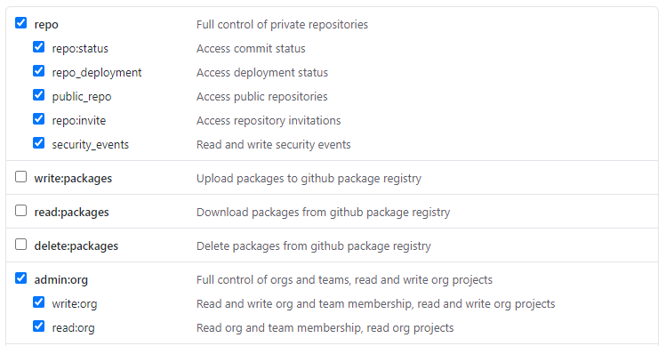
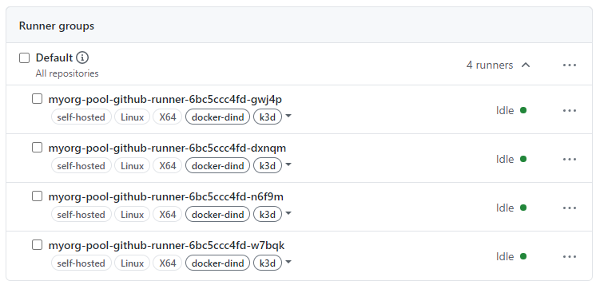

# github-k8s-runner
How to run your own GitHub build farm on a Kubernetes cluster, article, code

# References

This work is largely based on the work done by Sander Knape and David Karlsen:
- https://sanderknape.com/2020/03/self-hosted-github-actions-runner-kubernetes/
- https://github.com/evryfs/github-actions-runner-operator/

**Modifications:**
- Added a sidecar docker-dind with TLS TCP communication between the client and the daemon containers
- Made it dedicated to establish a pool of runners associated to a GitHub organization, not to a particular repository
- Added a way to prefix the runners names (with RUNNER_NAME_PREFIX env variable)
- Removed the sudo package, sudo group and passwordless sudoers from the container user
- Added a way to use self signed certificates for a local registry as a config map

# Howto

- As an **organization owner**, create a GitHub Personal Access Token with the *repo* and *admin:org* scope permissions:


- Create a generic secret with your GitHub Personal Access Token
  ``` shell
  kubectl create secret generic my-pat --from-literal=pat=XXXXXXXXXXXXXXXXXX
  ```

- If you want to include your registry self-signed CA certificate, use a config map
  ``` shell
  kubectl create configmap private-registry-certificate --from-file=ca.crt
  ```
- Adapt the [deployment.yml](./k8s-example/deployment.yml) Deployment resource to reflect your organization name in the GITHUB_OWNER environment variable, and deploy:
  ``` shell
  kubectl create -f k8s-example/deployment.yml
  ```
- You should see your runners appearing in the default group of your organization:
  
